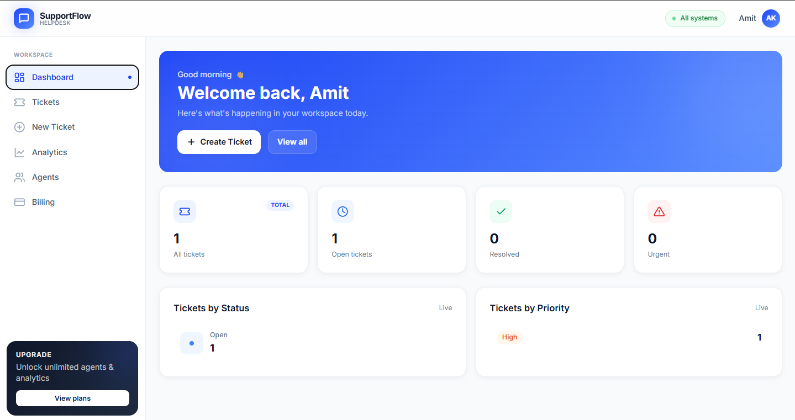
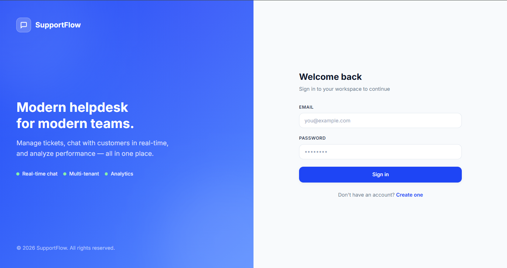
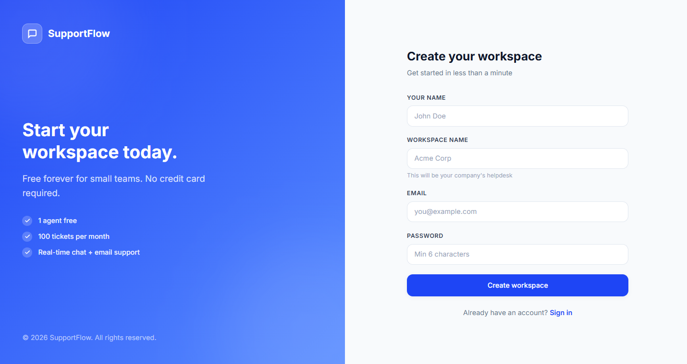
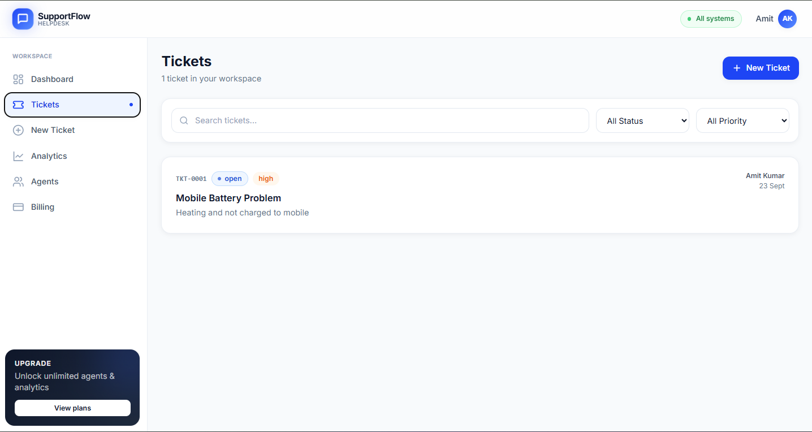
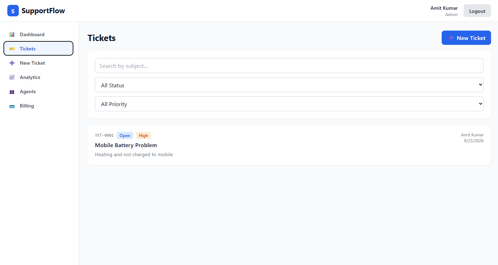
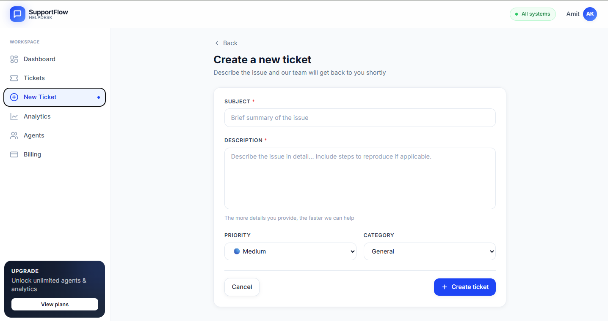
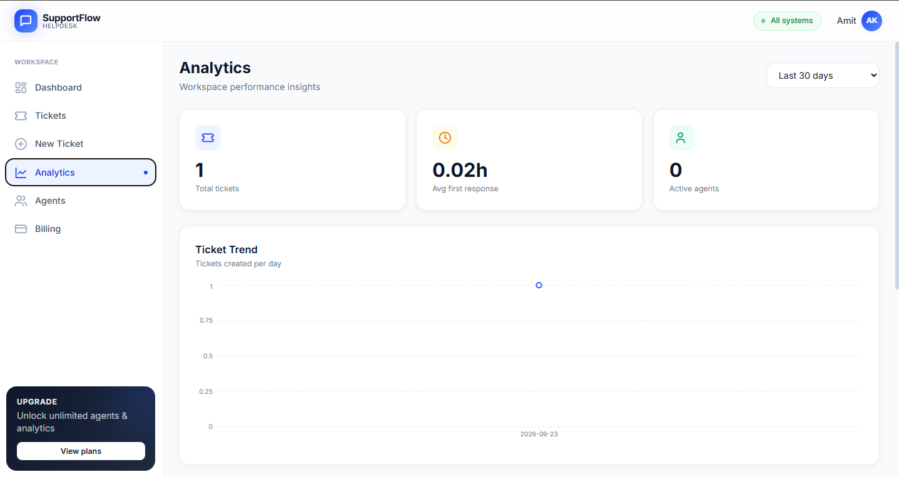
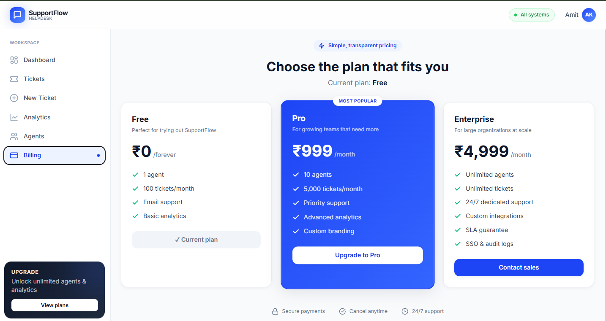
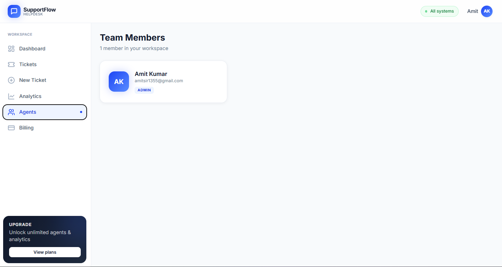

# 🎫 SupportFlow — Multi-Tenant SaaS Helpdesk

A production-ready, multi-tenant helpdesk platform where companies can manage customer tickets, chat in real-time, and analyze performance — all with subscription-based billing.



[](https://github.com/iamdeveloper17/SupportFlow)
[](./LICENSE)
[](https://nodejs.org)
[](https://mongodb.com)
[](https://react.dev)
[](https://redis.io)
[](https://support-flow-gamma.vercel.app)

## 🚀 Live Demo

- **Frontend:** [https://support-flow-gamma.vercel.app](https://support-flow-gamma.vercel.app)
- **Backend API:** [https://supportflow-7avd.onrender.com/health](https://supportflow-7avd.onrender.com/health)

### 🔑 Demo Credentials

| Role | Email | Password |
|------|-------|----------|
| Admin | amitsir1355@gmail.com | 123456 |

> ⚠️ **Note:** Backend runs on Render's free tier — the first request may take 30-50 seconds (cold start). This is normal.

## 📖 About

SupportFlow is a **multi-tenant SaaS helpdesk** built with the MERN stack. Companies can sign up, create their own isolated workspace, invite agents, and manage customer support tickets — all in real time.

Every workspace is fully isolated: users, tickets, messages, and analytics are scoped to the workspace, ensuring enterprise-grade data privacy.

## ✨ Features

### Core
- 🏢 **Multi-tenant architecture** — isolated workspaces per company
- 🔐 **JWT authentication** with refresh token rotation
- 👥 **Role-based access control** (Admin, Agent, Customer)
- 🎫 **Complete ticket lifecycle** — create, assign, update, resolve
- 💬 **Real-time chat** with Socket.io (public replies + internal notes)
- 📧 **Email notifications** via Nodemailer (ticket created, assigned, new reply)
- ⏰ **SLA tracking** with breach alerts (BullMQ + Redis)
- 📊 **Analytics dashboard** with charts (Recharts)
- 💳 **Stripe subscription billing** with plan-based limits
- 📎 **File uploads** via Cloudinary
- 🔍 **Search, filter, pagination**
- 🎨 **Modern UI** with TailwindCSS
- 📱 **Fully responsive** — mobile, tablet, and desktop
- 🐳 **Docker** + GitHub Actions CI/CD

## 🎯 How to Use

### 👨‍💼 For Admins (Company Owners)

1. **Sign up** — Create your workspace with your company name
2. **Invite agents** — Add team members to handle tickets
3. **Monitor tickets** — Track all customer tickets in your workspace
4. **Assign tickets** — Route tickets to the right agent
5. **Chat in real-time** — Reply to customers instantly with live chat
6. **Track SLA** — Get alerts before deadlines breach
7. **View analytics** — Analyze ticket trends, agent performance, response times
8. **Manage billing** — Upgrade plans via Stripe integration

### 👨‍💻 For Agents (Support Team)

1. **View assigned tickets** — See all tickets routed to you
2. **Reply to customers** — Send public replies visible to customers
3. **Add internal notes** — Collaborate with team (customers can't see these)
4. **Update status** — Mark tickets as Open → Pending → Resolved → Closed
5. **View performance** — Track your metrics on analytics dashboard

### 👤 For Customers

1. **Raise a ticket** — Describe your issue in detail
2. **Chat in real-time** — Get instant replies from support agents
3. **Track status** — See real-time updates on your tickets
4. **Attach files** — Share screenshots or documents
5. **Get email updates** — Notifications on every reply

## 📸 Screenshots

### 🔐 Authentication

| Login | Register |
|-------|----------|
|  |  |

### 📊 Dashboard — Overview of tickets and stats


### 🎫 Tickets

**Ticket List:**


**Ticket Detail with Real-time Chat:**


**Create New Ticket:**


### 📈 Analytics — Performance Insights



### 💳 Billing — Subscription Plans



### 👥 Agents — Team Management



## 📱 Responsive Design

SupportFlow is **fully responsive** — works seamlessly across all devices.

### 📱 Mobile View (375px)

<p align="center">
  
  
  
</p>

<p align="center">
  
  
  
</p>

<p align="center">
  
  
</p>

**Mobile Features:**
- 📱 Slide-in sidebar drawer with overlay
- 👆 Touch-friendly tap targets (min 44px)
- 📊 Responsive charts that adapt to screen size
- 🎨 Adaptive grid layouts (1-col mobile → 4-col desktop)
- ✨ Fluid typography that scales with viewport
- 🚫 Body scroll lock when drawer is open

## 🛠️ Tech Stack

### Frontend
- **React 18** + Vite
- **Redux Toolkit** for state management
- **React Router v6** for routing
- **TailwindCSS** for styling
- **Recharts** for data visualization
- **Socket.io Client** for real-time communication
- **Axios** with interceptors for auto-refresh tokens

### Backend
- **Node.js** + Express
- **MongoDB** + Mongoose (multi-tenant data model)
- **Redis** + BullMQ for job queues
- **Socket.io** for real-time messaging
- **JWT** with refresh token rotation
- **Zod** for request validation
- **Nodemailer** for transactional emails
- **Stripe** for subscription billing
- **Cloudinary** for file uploads
- **Helmet, CORS, Rate-limit** for security

### DevOps
- **Docker** + docker-compose
- **GitHub Actions** for CI/CD
- **Render** for backend deployment
- **Vercel** for frontend deployment
- **MongoDB Atlas** for cloud database
- **Upstash Redis** for cloud cache & queues

## 🏗️ Architecture

```
┌──────────────┐      ┌───────────────┐      ┌──────────────┐
│  React SPA   │─────▶│  Express API  │─────▶│   MongoDB    │
│  (Vercel)    │◀─────│   (Render)    │◀─────│   (Atlas)    │
└──────────────┘      └───────┬───────┘      └──────────────┘
                              │
              ┌───────────────┼───────────────┐
              │               │               │
         ┌────▼─────┐   ┌─────▼─────┐   ┌────▼─────┐
         │  Redis   │   │  BullMQ   │   │Socket.io │
         │(Upstash) │   │  Workers  │   │          │
         └──────────┘   └───────────┘   └──────────┘
```

## 🚀 Local Setup

### Prerequisites

- Node.js 18+
- MongoDB (local or [Atlas](https://cloud.mongodb.com))
- Redis (local, [Memurai](https://memurai.com), or [Upstash](https://upstash.com))
- Gmail account (for SMTP) — optional
- Stripe test account — optional
- Cloudinary account — optional

### 1. Clone the repository

```bash
git clone https://github.com/iamdeveloper17/SupportFlow.git
cd SupportFlow
```

### 2. Backend setup

```bash
cd server
npm install
cp .env.example .env
# Edit .env with your credentials
npm run dev
```

Server will run on `http://localhost:5000`

### 3. Frontend setup

```bash
cd ../client
npm install
cp .env.example .env
npm run dev
```

Client will run on `http://localhost:5173`

### 4. Open the app

Navigate to `http://localhost:5173/register` and create your first workspace.

## 🔑 Environment Variables

See `server/.env.example` and `client/.env.example` for the full list. Key variables:

| Variable | Description | Required |
|----------|-------------|:--------:|
| `MONGO_URI` | MongoDB connection string | ✅ |
| `REDIS_URL` | Redis connection string | ✅ |
| `JWT_ACCESS_SECRET` | JWT signing secret (32+ chars) | ✅ |
| `JWT_REFRESH_SECRET` | Refresh token secret (32+ chars) | ✅ |
| `CLIENT_URL` | Frontend URL for CORS | ✅ |
| `SMTP_*` | Gmail SMTP credentials | Optional |
| `STRIPE_*` | Stripe keys | Optional |
| `CLOUDINARY_*` | Cloudinary keys | Optional |

## 📁 Project Structure

```
SupportFlow/
├── client/                     # React frontend
│   ├── src/
│   │   ├── api/                # Axios config with auto-refresh
│   │   ├── app/                # Redux store
│   │   ├── features/           # Redux slices
│   │   ├── components/         # UI components
│   │   ├── pages/              # Route pages
│   │   ├── hooks/              # Custom hooks (useSocket, useAuth)
│   │   └── routes/             # Route guards
│   └── package.json
├── server/                     # Node backend
│   ├── src/
│   │   ├── config/             # DB, Redis, Stripe, Cloudinary
│   │   ├── models/             # Mongoose schemas
│   │   ├── controllers/        # Route handlers
│   │   ├── routes/             # Express routers
│   │   ├── middlewares/        # Auth, RBAC, validation
│   │   ├── services/           # Business logic
│   │   ├── sockets/            # Socket.io setup
│   │   ├── jobs/               # BullMQ queues
│   │   ├── validators/         # Zod schemas
│   │   └── utils/              # Helpers
│   └── server.js
├── screenshots/                # Desktop & mobile screenshots
├── .github/workflows/          # GitHub Actions CI
├── docker-compose.yml
├── LICENSE
└── README.md
```

## 🎯 Roadmap

- [x] Multi-tenancy with isolated workspaces
- [x] JWT auth + refresh token rotation
- [x] Role-based access control (4 roles)
- [x] Complete ticket CRUD lifecycle
- [x] Real-time chat (Socket.io + Redis adapter)
- [x] Email notifications (Nodemailer)
- [x] SLA tracking (BullMQ delayed jobs)
- [x] Analytics dashboard (MongoDB aggregation)
- [x] Stripe subscription billing
- [x] Cloudinary file uploads
- [x] Docker + GitHub Actions CI
- [x] Fully responsive design (mobile-first)
- [ ] WhatsApp integration
- [ ] Mobile app (React Native)
- [ ] AI-powered ticket categorization

## 💡 Technical Highlights

- **Cross-domain cookies** — `SameSite=None` + `Secure` + CORS credentials handling for Vercel + Render split deployment
- **JWT expiry handling** — auto-refresh via Axios interceptor with retry queue and refresh token rotation
- **Duplicate message prevention** — ID deduplication + Socket.io `.except()` to exclude sender from broadcast
- **Multi-tenant isolation** — compound indexes on `workspace` field for query performance
- **Real-time scaling** — Socket.io with Redis adapter for multi-instance support
- **Case-sensitive CI fix** — proper file naming conventions for Linux compatibility
- **Mobile-first design** — slide-in drawer, adaptive grids, touch-friendly components

## 🤝 Contributing

Contributions are welcome! Feel free to open an issue or submit a PR.

## 📄 License

This project is licensed under the MIT License — see the [LICENSE](./LICENSE) file for details.

## 👨‍💻 Author

**Amit Kumar**

- GitHub: [@iamdeveloper17](https://github.com/iamdeveloper17)
- LinkedIn: [@amit-kumar-9193b0216](https://www.linkedin.com/in/amit-kumar-9193b0216)
- Email: ramit5752@gmail.com

---

⭐ **If you find this project useful, please give it a star!**